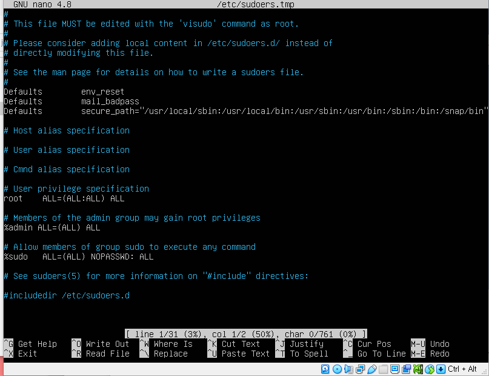

### sudo 시 비밀번호 입력하지 않고 sudo 사용하는 법

1. `sudo visudo` 커맨드를 입력

2. 

   위처럼 %sudo 부분 중 `ALL=(ALL) NOPASSWORD:ALL` 로 바꿔준다

3. 끝!

## Gitlab  VM에 설치하기

1. https://about.gitlab.com/install/#ubuntu에 들어간다

2. 적혀있는 코드 순서대로 커맨드 입력해서 다운받기

   > `sudo EXTERNAL_URL="https://gitlab.example.com" apt-get install gitlab-ee` 대신
   >
   > `sudo EXTERNAL_URL="http://gitlab.test" apt-get install gitlab-ee`으로 해주는 것이 좋음

   - https는 유효한 호스트이름이 필요하기 때문

