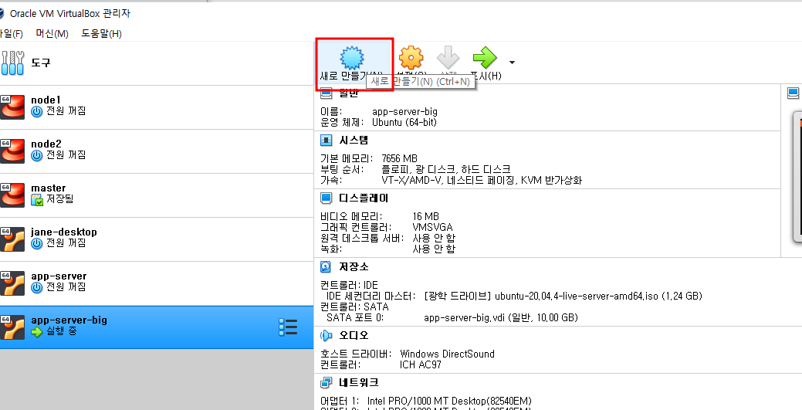
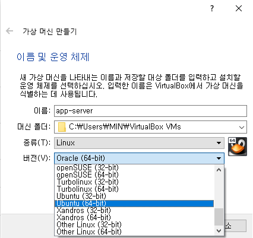
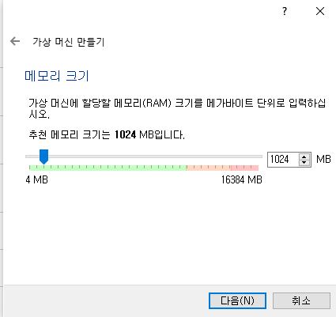
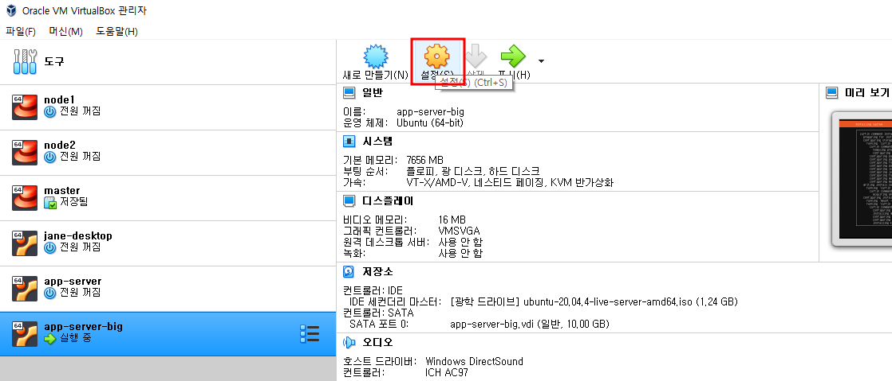
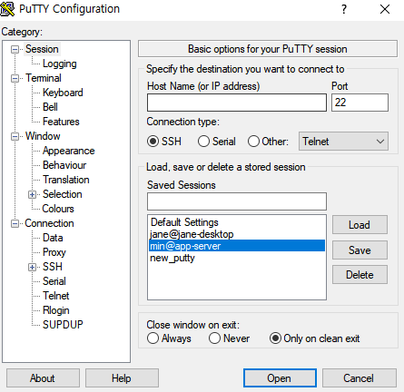

purge cache란?

- 캐시 서버에 캐**싱된 컨텐츠를 강제로 삭제**하여 원본 서버로부터 **갱신된 콘텐츠를 가져와서 서비스** 할 수 있음

`dpkg`

- 데비안 패키지 관리 시스템의 기초가 되는 소프트웨어
-  고급 도구에 비해 낮은 레벨의 도구
- `gitlab-ee` 설치 도중 이 쪽에 문제가 생겼다는 로그를 발견했다.
  - 하루 종일 삽질 끝에...메모리가 문제일 수 도 있겠다는 깨달음을 얻음
  - 강의자 이자식...

이제 진짜 우분투 서버 그만 만드려고 만드는 가이드

1. 

2. 
3. 
   - 강의와는 다르게 메모리 할당을 조금 더 크게 할 필요가 있는 듯 함
4. 걍 다 `다음` 눌러주삼
5. 

6. 

## PuTTy 접속 가이드

1. 

2. 접속하려는 VM에 들어간다
   1. ubuntu일 경우 `ip a` 입력
3. `Host Name` 부분에 `이름@ip주소` 입력
   1. saved sessions 에 이름 입력해주면 차후 접속 용이해짐
4. 접속 완