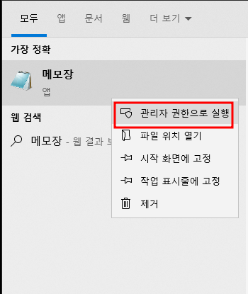
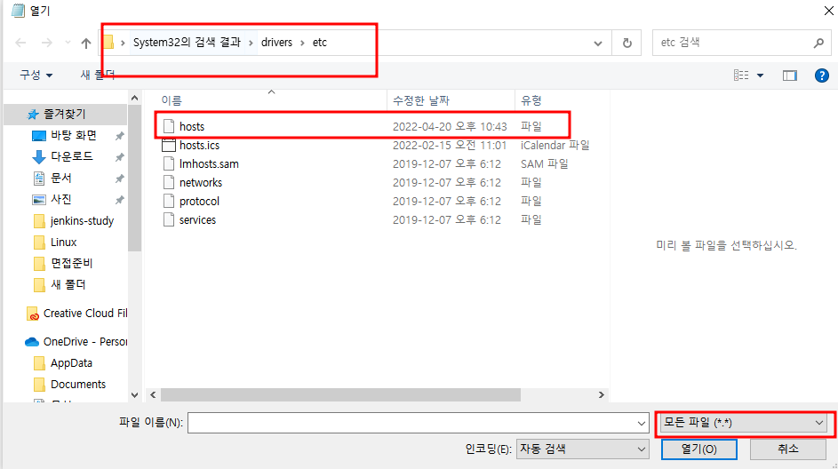
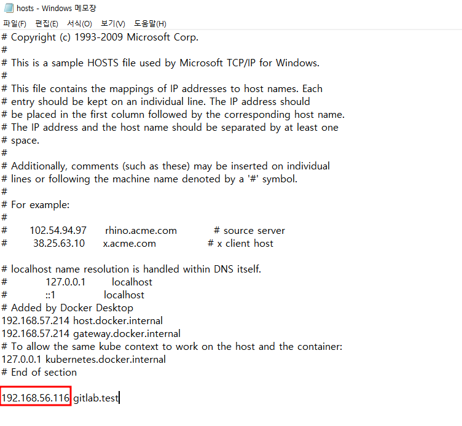
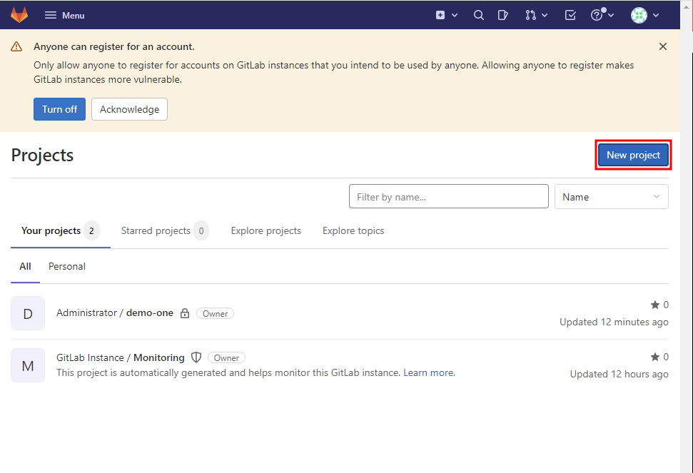
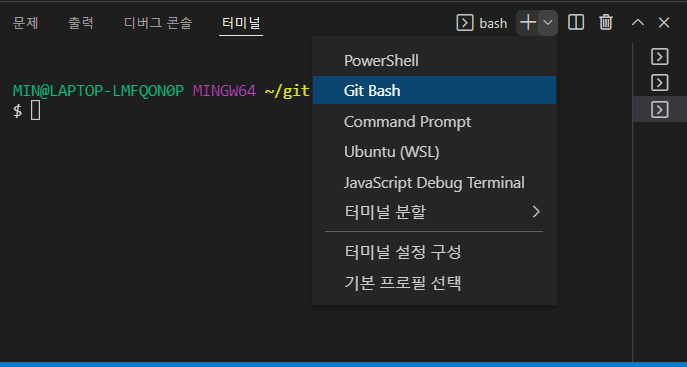

### gitlab 설치 완료 시

1. 

2. 

3. 

- 여기에 ip주소는 본인 VM의 ip주소이다.
  - ip주소는 ubuntu는 `ip a`

4. 

- `gitlab.test` 주소를 주소창에 치면 이렇게 들어가진다!

- 아놔 그러면 뭐하냐고ㅡ.ㅡ 계정 우짤래미;;

5. 

- `sudo gitlab-rails console -e production`
- `user = User.where(id:1).first`
- `user.password='password1'`

- `user.password_confirmation='password1'`
  - 한 뒤에 ID: root/ PW: password1 작성하면 됨
- ㅋㅋ...진짜 열받넹
- 아무래도 영문과 숫자가 같이 있어야 했었나봄..다른 글들은 숫자로도 잘만되더만 삽질해서야 체득하게되네ㅋㅋ
- 아주 삽질하다가 우루과이까지 가겠어 그냥

5. 

- `create blank project`

6. 생성 창에서 이름 적고 private로 돌린다.
7. ssh 하라는 얘기가 없어서 그냥 바로 `git bash`에 `clone` 해주면 됨

### VS Code에서 git bash 사용하기

